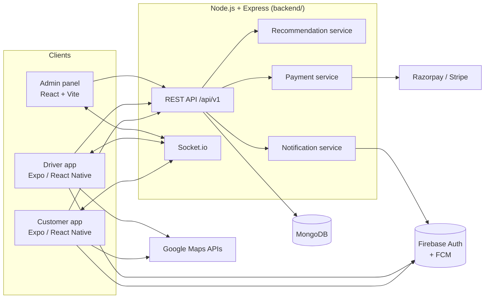

# Savora — Architecture

## System overview



## Authentication flow

1. The app performs **Firebase phone-OTP** (or email) sign-in entirely on-device.
2. The app sends the resulting **Firebase ID token** to `POST /api/v1/auth/firebase`.
3. The backend verifies the token with Firebase Admin, upserts the `User`, and returns a **Savora session JWT** (7-day expiry) that authorizes every subsequent REST call and the Socket.io handshake.
4. FCM device tokens are registered at login and pruned at logout.

Why the exchange? It keeps Firebase as a pure identity provider while the backend owns roles (`customer` / `driver` / `admin` / `restaurant_owner`), blocking, and session lifetime.

## Realtime model (Socket.io)

| Room | Members | Events |
|---|---|---|
| `order:<id>` | customer, assigned driver, admins | `order:update`, `driver:location` |
| `driver:<userId>` | one driver | `order:offer` |
| `admin` | admin panel sessions | `order:update` |

Drivers publish GPS via `driver:location` (client → server); the server persists the last position and fans it out to the order room. Customers join `order:watch` while the tracking screen is mounted. REST polling (30 s) backs up the socket on flaky networks.

## Order lifecycle

```
pending_payment → placed → confirmed → preparing → ready_for_pickup
      ↓              ↓         ↓            → picked_up → on_the_way → delivered
   cancelled     cancelled  cancelled
```

Transitions are whitelisted server-side (`STATUS_FLOW`); every change appends to `statusHistory`, emits a socket event, and sends an FCM push. Driver assignment uses an **atomic claim** (`findOneAndUpdate` with `driver: {$exists: false}`) so two riders can't take the same order; delivered orders credit the driver's earnings ledger.

## Payments

- Server computes all prices — the client cart is never trusted.
- Razorpay: server creates a provider order → app opens the native checkout sheet → server verifies the **HMAC signature** (timing-safe) before marking the order paid and dispatching a driver.
- Stripe: PaymentIntent with `client_secret` for international cards.
- COD skips the payment step and dispatches immediately.

## Mobile app state strategy

| Concern | Tool | Notes |
|---|---|---|
| Server data | TanStack Query | persisted to AsyncStorage → offline cold-start with last-known data |
| Cart, auth session, theme | Zustand + persist | pure client state, survives restarts |
| Forms | React Hook Form + Zod | OTP/phone validation, checkout |
| Realtime | Socket.io client | tracking screen only; disconnects on sign-out |

## Performance decisions

- `expo-image` with `memory-disk` cache + blurhash placeholders.
- FlatList windowing (`removeClippedSubviews`, tuned `windowSize`) on all feeds; skeleton loaders on every loading state.
- Animations run on the UI thread via Reanimated (`useSharedValue` springs) — no JS-thread jank.
- Search input is debounced 350 ms; list queries are cached per filter combination and paginated (infinite query).
- Splash screen hides as soon as persisted state hydrates — no blocking network on startup.

## Security

- Helmet, CORS allow-list, 300 req/min rate limit, 1 MB JSON body cap.
- Zod validation on every write endpoint; Mongoose strict schemas.
- Role middleware (`requireRole`) on driver/admin routes; order reads check ownership.
- Payment verification is server-side only; coupon usage limits enforced in the DB.
- JWT secret, provider keys, and the Firebase service account live only in environment variables.
